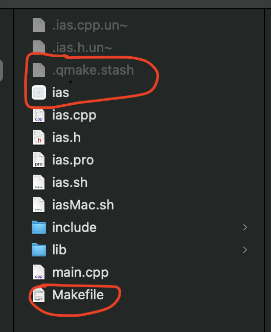
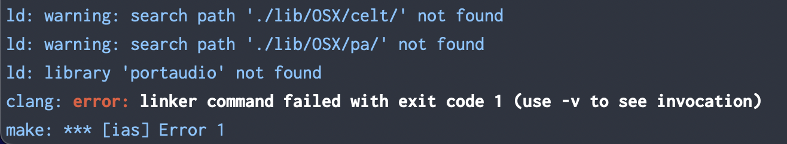
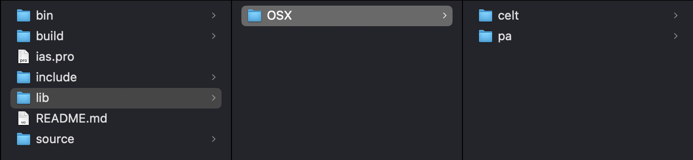

# Modul Interaktive Audiosysteme

### Anleitungen für MacOS ab 14.7 (Intel und Apple Silicon)

> [!TIP]
> Wir haben die statischen Libraries für portaudio und opus im Repository zur Verfügung gestellt. Allerdings wurden diese Versionen auf einem Mac mit Apple-Silicon Chip kompiliert, d.h. für eine Nutzung mit Intel-Chips sind sie ggf. nicht geeignet.
> Wenn das Projekt auf einer anderen Mac-Architektur als arm64 ausgeführt werden soll, müsste zumindest Opus, ggf. auch Portaudio, erneut kompiliert werden.
> Dafür bitte vorgehen, wie [hier (Opus)](#opus-library-integrieren) und [hier (Portaudio)](#portaudio-library-integrieren) beschrieben.

```bash
# build (after editing the .pro file):
qmake ias.pro
make

# build (after only editing the code):
make

# build and run A
# main.cpp: Zeilen 107-111 einkommentieren, 114-129 auskommentieren
# make
./ias -i <ip-address>

# build and run B-E
# main.cpp: Zeilen 107-111 auskommentieren, 114-129 einkommentieren
make
./ias -i <ip-address>

# quit application (on Mac): Ctrl + C
```
---

## Qt Grundlagen

### Qt installieren & konfigurieren
*Qt ist eine große, gut dokumentierte C++ Bibliothek, die den Einstieg in die Sprache vereinfachen kann. 
Qt implementiert Event-Funktionalitäten über das Signal/Slot Modell.
Hier gibt es Tipps zur Installation und zu ersten Schritten.*

<details>

<summary> ▶️ Ausklappen</summary>

1. Qt installieren: [Open Source](https://www.qt.io/licensing/open-source-lgpl-obligations)
   oder [Educational License](https://www.qt.io/qt-educational-license)
2. Um C++ Projekte zu bauen, wird ein Build-System benötigt. Qt hat dafür ein eigenes Tool entwickelt: [qmake](https://doc.qt.io/qt-6/qmake-overview.html), das beim ersten Schritt automatisch mit installiert worden sein sollte. 
   Alternativ dazu kann natürlich auch ein Build-System wie `cmake`genutzt werden. 
   Beide Systeme erstellen einen `Makefile`, der vom `make` Befehl gelesen wird, um das Projekt zu bauen.
3. Wenn Qmake genutzt wird, muss das Build-System noch im Terminal konfiguriert werden:  
   *Info: Der Befehl `qmake` erstellt einen Makefile, der alle Informationen zum Kompilieren enthält.*
    1. Zuerst muss der Pfad zur Qt Binary in der Profile-Datei gesetzt werden. 
       Je nach genutzter Shell heißt die Datei unterschiedlich - auf manchen Maschinen (v.a. wenn der Mac neu oder frisch aufgesetzt ist), kann es sein, dass die Datei noch gar nicht existiert. 
       Am besten einmal googlen, wie sie für das eigene Betriebssystem heißen könnte und wo sie liegt, à la “Profile file on Mac OS <X>”.

        ```bash
        # Pfad in der profile-Datei setzen - Name hängt von der genutzten shell ab.
        # Welche shell nutze ich?:
        echo $SHELL
        # für zhs heißt die Datei z.B. .zprofile oder .zshrc, also Datei öffnen (oder anlegen, falls nötig):
        open ~/.zprofile
        ```

        ```
        # Dort den Pfad zum Qt 'bin' Verzeichnis in eine neue Zeile schreiben + speichern
        # Replace <...> (incl. braces) with your own path
        export PATH=</Users/myname/Qt/6.9.2/>macos/bin:$PATH
        ```

    2. Konsole beenden und anschließend neu starten
    3. Testen:

        ```bash
        qmake
        ```

       Der Befehl sollte jetzt gefunden werden. 
       Falls nicht, stimmt wahrscheinlich der gesetzte Pfad zur Qt-Installation nicht.
   


### Basics: Konsolenausgabe & Input

[Tutorial](https://youtu.be/smQms-2yJYc?si=abzgEe0WbT2DSZJf)

- \<QTextStream\> und \<QDebug\>
- siehe Klasse "BasicLogging.cpp"

### Signals & Slots

[Tutorial](https://www.youtube.com/watch?v=KugPAznC4Yo&list=PLUbFnGajtZlXbrbdlraCe3LMC_YH5abao&index=6)

- Basically Observer Pattern: You can connect signals to slots so that slots (functions) are called when the signal is
  emitted.
- s. Klassen "Observer" und "Reporter"
  
</details>

---

## Reference-Code kompilieren
*Im moodle Kurs ist der Referenzcode mit unterstützenden Videos verfügbar. 
Diese Anleitung erklärt, wie der Code auf dem eigenen Mac ausgeführt werden kann.*

<details>

<summary> ▶️ Ausklappen</summary>

[Tutorials + Code](https://moodle.hs-anhalt.de/course/view.php?id=1103#section-9)

1. [Code](https://moodle.hs-anhalt.de/mod/resource/view.php?id=169159) herunterladen
2. Archiv entpacken
3. Im Finder oder im Terminal in den entpackten Ordner navigieren (im Finder: mit `shift`+ `cmd`+ `.` versteckte Dateien anzeigen)
4. Die Dateien `.qmake.stash`, `ias(.app)` und `Makefile` löschen

   

5. Über das Terminal einen neuen `Makefile`generieren:

    ```bash
    # In den root-Ordner navigieren
    cd Reference-Code
    # dort den makefile generieren
    qmake ias.pro
    ```

   &rarr; erstellt auch einen an die aktuelle SDK-Version angepassten `.stash`-file

6. Das Projekt kompilieren:

    ```bash
    make
    ```

   &rarr; Jetzt sollte im Ordner wieder eine Datei `ias.app` liegen.

7. Dann kann das Programm ausgeführt werden:

    ```bash
    # starten:
    ./ias
    ```

   und mit `ctrl`+ `c` wieder beendet werden.

</details>

---

## Eigenes Projekt erstellen + kompilieren

*Um die Praxis-Aufgaben zu implementieren, muss zuerst ein eigenes qmake- (oder cmake-) Projekt aufgesetzt werden.
Diese Anleitung beschreibt, wie das Projekt mit `qmake` aufgesetzt wird.* 

<details>
<summary> ▶️ Ausklappen</summary>

1. Im Qt-Creator ein leeres Projekt erstellen:
    - Qt Konsolenanwendung
    - Build System: qmake
2. Den Inhalt der `ias.pro` Datei aus dem Referenz-Code für die eigene `.pro` Datei im neuen Projekt übernehmen  
   *ACHTUNG: Für eine aktuelle Version der Datei **für Windows** bitte an Prof. Carôt wenden*

3. Im eigenen Projektfile jetzt am Ende bei `HEADERS +=`  und `SOURCES +=` alle Dateien auskommentieren / löschen, die (noch) nicht im eigenen Projekt existieren und ggf. entsprechend die hinzufügen, die existieren.
4. Den `Makefile` wie folgt erstellen:

    ```bash
    # in den eigenen Projektodner navigieren
    cd my-ias-project
    # mit qmake den Makefile basierend auf dem eigenen .pro file erstellen
    qmake myIas.pro
    ```

5. Wenn man jetzt das Projekt mit `make` bauen will, bekommt man sehr wahrscheinlich folgenden Error:

   

   Das liegt daran, dass die Ordnerstruktur, die in der `.pro`-Datei angegeben wird, noch gar nicht existiert.
   Es gibt nun zwei Möglichkeiten: Entweder wir brechen die `.pro`-Datei auf das Wesentliche herunter und bauen sie nach und nach aus, oder wir übernehmen die Datei, wie sie ist - müssen dann aber bereits alle benötigten Bibliotheken herunterladen und kompilieren, sowie die angegebene Ordnerstruktur erstellen.
   Für Aufgabe A starten wir mit einem Basic `.pro` file, den wir auf das Wesentliche zusammengekürzt haben (Angaben für Linux und Windows wurden für eine besere Übersichtlichkeit gelöscht):
    
    ```txt
    macx{
     DEFINES  += __MACOSX_CORE__
     # This depends on your OS
     QMAKE_MACOSX_DEPLOYMENT_TARGET = 15.0
   }

   # This tells the compiler where to put the executable 
   DESTDIR = ./bin

   # This tells the compiler how to name the executable (TARGET) 
   # and where to put the generated .o/.obj and .moc files so they dont overcrowd the root folder
   CONFIG(release){
     TARGET = ias
     OBJECTS_DIR = ./build/objects
     MOC_DIR = ./build/mocs
   }

   CONFIG += thread qt warn_on exceptions

   CONFIG += console c++17 cmdline sdk_no_version_check

   QT += core network widgets

   HEADERS += 

   SOURCES +=  main.cpp 
   ```
    
    Hier müssen natürlich noch die verwendeten `.cpp` und `.h`-Dateien entsprechend ergänzt werden. 
    Für mehr Infos zur `.pro`-Datei, siehe [QT Docs](https://doc.qt.io/qt-6/qmake-project-files.html).  
    Anschließend kann das Projekt im Terminal kompiliert werden:
    
    ```bash
    # mit qmake den Makefile basierend auf dem eigenen .pro file erstellen:
    qmake myIas.pro
    # das Projekt bauen: 
    make
    ```
    
   Alternativ kann das Projekt auch über die GUI im Qt-Creator gebaut werden.

</details>

---

# Aufgabenteil

## A. UDP-Transceiver (Transmitter/Receiver)

### Aufgabe

Im Sekundentakt sollen Daten via UDP-Protokoll an einen entfernten Server gesendet werden, welcher als Reflektor fungiert.
Das heißt, er schickt die Daten sofort wieder zurück.
Pro Sekunde soll eine Zahl gesendet werden: von 1 bis 10 und dann wieder von vorne.
Der Rückerhalt einer Zahl vom Reflektor soll mit der Konsolenausgabe "Wert \<x\> empfangen" quittiert werden.
IP-Adresse und Port des Reflektors werden als User-Input entgegengenommen.

### Lösung

Die gesamte Aufgabe wurde mit der Klasse [client](https://github.com/Graunarmin/ias_InteraktiveAudiosysteme/blob/main/source/transceiver/client.cpp) gelöst:

- Wir nutzen einen Timer vom Typ [QTimer](https://doc.qt.io/qt-6/qtimer.html). Dieser triggert bei jedem Zeitschritt das Signal `QTimer::timeout`, welches wir mit dem Slot [slotSendTimerData](https://github.com/Graunarmin/ias_InteraktiveAudiosysteme/blob/cb17030402904a52d5683982e74e8b53ee9b6098/source/transceiver/client.cpp#L65) verbinden.
- Das `QUdpSocket::readyRead`-Signal des [QUdpSocket](https://doc.qt.io/qt-6/qudpsocket.html) verbinden wir mit dem Slot [slotReceivedReflectedTimerData](https://github.com/Graunarmin/ias_InteraktiveAudiosysteme/blob/cb17030402904a52d5683982e74e8b53ee9b6098/source/transceiver/client.cpp#L91) unserer Client-Klasse.

*Um Aufgabe A auszuführen:
In der [main.cpp](https://github.com/Graunarmin/ias_InteraktiveAudiosysteme/blob/main/source/main.cpp) die Zeilen 107-111 einkommentieren und Zeilen 114-129 auskommentieren. 
Dann das Programm wie gewohnt bauen und ausführen, dabei IP-Adresse (-i) und Port-Nummer (-p, optional) angeben.*


## B. Konfiguration des Portaudio-Projektes

### Aufgabe

Ein Portaudioprojekt soll aufgesetzt und kompiliert werden.  
Im Projekt soll die Portaudio Callback-Funktion benutzt werden, um Sound einzulesen und auszugeben.
  *Die Callback-Funktion liest den Sound-Input ein, der über das angegebene Input-Gerät auf der Soundkarte ankommt, und gibt den Sound, den wir in den Output-Buffer schreiben, über das angegebene Output-Gerät aus.*

###### Audio Standard 
- Samplerate: 48kHz (So viele Samples werden pro Sekunde aufgenommen)
- Bittiefe: 16 Bit (Die "Auflösung" des Sounds)
- Audiokanäle: 1
- Framesize: 512 Samples (heißt eigentlich 512 Samples pro Frame - für portaudio aber 512 Frames *(= Samples, s. Erklärung unten)* per Buffer)

> [!WARNING]
> Für portaudio ist ein Frame = ein Sample * Anzahl der Audiokanäle (in unserem Fall also ein Sample pro Frame).  
> &rarr; Die angegebene "Framesize" von 512 ist für portaudio die Anzahl "Frames per Buffer", also die Anzahl der Frames, die portaudio sammelt, bis die Callback-Funktion das nächste Mal aufgerufen wird.

### Lösung

#### Portaudio-Projekt aufsetzen und konfigurieren

Um externe Bibliotheken wie Portaudio in das Projekt einzubinden, muss der `.pro`-file nun entsprechend angepasst werden.

##### Ordnerstruktur anlegen

Folgende Ordnerstruktur im root-Ordner des eigenen Projekts erstellen (das README.md ist irrelevant):




> [!TIP]
> Wenn man im Laufe des Projekts QObjects benutzt, generiert qmake `.moc` Dateien und legt sie, genau wie die
> Object-Dateien (*.o/*.obj), in den Root-Ordner.  
> Um zu vermeiden, dass der Root-Ordner dadurch zu unübersichtlich wird, kann man die Projekt-Datei wie folgt ergänzen:
>
> ```bash
> # legt den build in den Ordner bin/
> DESTDIR = ./bin
>
> # legt alle .o/.obj sowie alle moc-Dateien unter /build ab
> CONFIG(release){
>   TARGET = ias
>   OBJECTS_DIR = ./build/objects
>   MOC_DIR = ./build/mocs
> }
> ```

##### Portaudio Library integrieren

1. Portaudio [herunterladen](https://files.portaudio.com/download.html), aber statt des aktuellen stable Releases den Release von 2016 benutzen. *(Dazu ggf. noch mal bei Prof. Carôt nachfragen! Vielleicht ist der stable release mittlerweile gefixt.)*
2. Portaudio im `/include` Ordner des eigenen Projekts entpacken, im Terminal in den Ordner navigieren und mit `./configure --disable-mac-universal` konfigurieren
3. Die generierte `libportaudio.a`  kopieren (versteckte Dateien anzeigen mit `shift + cmd + .` , Datei liegt im portaudio Ordner unter `lib/.libs` ) …
4. … und im Ordner `lib/OSX/pa/` einfügen
5. Die `.pro`-Datei anpassen: 

```bash
QMAKE_LIBDIR = $$PWD/lib

macx{
  QMAKE_LIBDIR += $$PWD/lib/OSX/celt/
  QMAKE_LIBDIR += $$PWD/lib/OSX/pa/

  LIBS      += -framework CoreAudio -framework AudioToolbox -framework AudioUnit -framework CoreServices
  LIBS      += -lportaudio
  LIBS      += -lpthread

  DEFINES  += __MACOSX_CORE__
  QMAKE_MACOSX_DEPLOYMENT_TARGET = 15.0
}

DESTDIR = ./bin

CONFIG(release){
  TARGET = ias
  OBJECTS_DIR = ./build/objects
  MOC_DIR = ./build/mocs
}

#DEFINES += PORTAUDIO

#INCLUDEPATH += .
#INCLUDEPATH += ./include/
#INCLUDEPATH += ./include/portaudio-snapshot/include/

CONFIG += thread qt warn_on exceptions

CONFIG += console c++17 cmdline sdk_no_version_check

QT += core network widgets

HEADERS += \
    client.h \

SOURCES +=  main.cpp \
    client.cpp \
```

> [!NOTE]
> Die zur Verfügung gestellte `.pro`-Datei wurde so angepasst, dass das Projekt auch im Qt-Creator gebaut werden kann, damit z.B. der Debugger nutzbar ist.
> Dazu muss bei allen library paths (`QMAKE_LIBDIR`-Variable) der führende `.` durch `$$PWD` ersetzt werden. 
> Das hat etwas damit zu tun, dass dieser Pfad vom Compiler erstmal nur an den Linker weitergereicht wird und der relative Pfad dann nicht mehr stimmt. 
> In der `$$PWD`-Variable hat qmake das Projektverzeichnis gespeichert. 
> Die Variable `QMAKE_LIBDIR = $$PWD/lib` sollte außerdem in der ersten Zeile der `.pro` Datei gesetzt werden. 
> Die beiden folgenden `QMAKE_LIBDIR += ...`  Angaben weiter unten müssen auch entsprechend angepasst werden – oder besser noch man streicht sie und benutzt die `LIBS += ...` Variablen mit den Flags `-L` und `-l` so, wie die  [Qt-Dokumentation es vorschlägt](https://doc.qt.io/qt-6/qmake-variable-reference.html#qmake-libdir).

#### Implementierung
- Die Callback-Funktion wurde in der [portAudioCallback.cpp](https://github.com/Graunarmin/ias_InteraktiveAudiosysteme/blob/main/source/transceiver/portAudioCallback.cpp) implementiert.
- In der [main.cpp](https://github.com/Graunarmin/ias_InteraktiveAudiosysteme/blob/main/source/main.cpp) wird ein Objekt vom Typ [Audiomanager](https://github.com/Graunarmin/ias_InteraktiveAudiosysteme/blob/main/source/transceiver/audiomanager.cpp) erstellt. Dieses Objekt initialisiert portaudio und startet den Audiostream.
- Wir haben eine variable Nutzung mit Flags über Konsoleneingabe bei Programmstart vorgesehen, aber alle Variablen haben Defaultwerte. Default der IP-Adresse ist localhost; dieser Wert muss neu gesetzt werden, wenn die Mirror-Funktion des Servers genutzt werden soll (IP-Adresse bei Prof. Carôt erfragen). Außerdem sollten natürlich die Indizes für das Input- und das Output-Gerät je nach Rechner angepasst werden - hierzu geschieht im Programmablauf eine Abfrage. Um die Werte nicht jedes Mal neu eingeben zu müssen (und wenn man sie nicht hard-coden will), kann es sinnvoll sein, ein shell script mit den Werten für das eigene Setup vorzubereiten.

*Um Aufgaben B bis E auszuführen:
In der [main.cpp](https://github.com/Graunarmin/ias_InteraktiveAudiosysteme/blob/main/source/main.cpp) die Zeilen 107-111 auskommentieren und Zeilen 114-129 einkommentieren. 
Dann das Programm wie gewohnt bauen und ausführen, dabei mindestens die IP-Adresse (-i) und Geräte-Indizes angeben (-m und -l).*
 
 
## C. Encodierung und Decordierung der Audiobuffer via OPUS

### Aufgabe
Die oben festgelegten Parameter führen zu einem Datenaufkommen von 768 kBits. 
Dieses Datenaufkommen soll auf 96 kBit/s reduziert werden. 
Dazu soll der Input-Buffer mit [Opus](https://opus-codec.org/docs/opus_api-1.5/group__opus__custom.html) codiert und anschließend wieder decodiert werden.

### Lösung
#### Opus Library integrieren
[Opus Library](https://opus-codec.org/downloads/) herunterladen und kompilieren:
1. Opus im `/include` Ordner des eigenen Projekts entpacken, im Terminal in den Ordner navigieren und wie folgt konfigurieren:

```bash
# in den entpackten Ordner navigieren
cd include/opus-<version> 
./configure --enable-custom-modes
make
```
3. Die generierte libopus.a aus dem `.libs` Ordner (versteckte Dateien anzeigen!) kopieren ...
4. ... und in den Ordner lib/OSX/celt/ einfügen
5. Die `.pro`-Datei anpassen: 

```bash
QMAKE_LIBDIR = $$PWD/lib

macx{
  QMAKE_LIBDIR += $$PWD/lib/OSX/celt/
  QMAKE_LIBDIR += $$PWD/lib/OSX/pa/

  LIBS      += -framework CoreAudio -framework AudioToolbox -framework AudioUnit -framework CoreServices
  LIBS      += -lportaudio
  LIBS      += -lpthread
  LIBS      += -lopus

  DEFINES  += __MACOSX_CORE__
  QMAKE_MACOSX_DEPLOYMENT_TARGET = 15.0
}

DESTDIR = ./bin

CONFIG(release){
  TARGET = ias
  OBJECTS_DIR = ./build/objects
  MOC_DIR = ./build/mocs
}

DEFINES += PORTAUDIO

INCLUDEPATH += .
INCLUDEPATH += ./include/
INCLUDEPATH += ./include/portaudio-snapshot/include/
INCLUDEPATH += ./include/opus-1.5.2/include/

CONFIG += thread qt warn_on exceptions

CONFIG += console c++17 cmdline sdk_no_version_check

QT += core network widgets

HEADERS += \
    client.h \
    audiomanager.h \
    # ...

SOURCES +=  main.cpp \
    client.cpp \
    audiomanager.cpp \
    # ...
```

### Implementierung
- Für diese Aufgabe haben wir die Klasse [Codec](https://github.com/Graunarmin/ias_InteraktiveAudiosysteme/blob/main/source/transceiver/codec.cpp) ergänzt. Sie kümmert sich um alles, was Opus betrifft und stellt eine `Encode()` und eine `Decode()` Funktion zur Verfügung.

## D. Verbindung von A und B

### Aufgabe
Anstelle der Zahlenwerte aus Aufgabe *A* soll nun der codierte Audio-Input an den Server gesendet werden. Das
reflektierte Audio soll dann zurückempfangen, decodiert und wieder hörbar gemacht werden. 

### Lösung
- Wir haben unsere Client-Klasse aus Aufgabe *A* entsprechend angepasst.

## E. Jitterbuffer

### Aufgabe
Es ist davon auszugehen, dass Schritt D Probleme hinsichtlich eines soliden AudioPlayback aufzeigen wird, da die
Übertragungsverzögerung durch den Network-Jitter beeinträchtigt wird. Aus diesem Grunde soll ein Jitterbuffer (
FIFO-Buffer) implementiert werden, der eine gewünschte Anzahl von Audiopaketen puffert, bis diese vom Audioprozess
gelesen werden. Ideal ist eine Implementierung, die es erlaubt, Puffergrößen zwischen 1 und 50 variabel einzustellen.

### Lösung
- Wir haben den [Jitterbuffer als eigene Klasse](https://github.com/Graunarmin/ias_InteraktiveAudiosysteme/blob/main/source/transceiver/jitterbuffer.cpp) implementiert.
- Der Jitterbuffer verwaltet einen Queue, die SharedPointer auf die zurückempfangenen, ggf. noch codierten, Arrays mit Audiodaten hält. Der Audiomanager bekommt über ein Signal vom Client diese Pointer und fügt sie über die bereitgestellte `Add()`-Funktion zum Buffer hinzu. Die Callback-Funktion kann dann jeweils den ersten Pointer in der Queue anfragen, und wenn der Buffer entsprechend groß ist, gibt er die Daten raus.
- Auch die Größe des Jitterbuffers lässt sich über Flags eistellen. Der Defaultwert ist auf 50 gesetzt, aber die Größe wird auch zu Beginn des Programms einmal abgefragt. Anschließend kann sie nur nach einem Neustart geändert werden.
